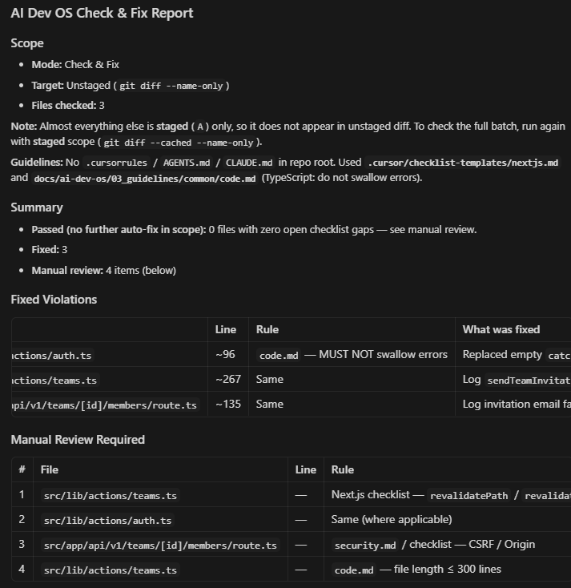

# AI Dev OS Plugin — Cursor

[](https://github.com/yunbow/ai-dev-os-plugin-cursor/actions/workflows/lint.yml)
[](../../../LICENSE)

AI Dev OS の4層モデルを Cursor の Rules システム（`.cursor/rules/*.mdc`）に統合するプラグインです。

**[AI Dev OS](https://github.com/yunbow/ai-dev-os) の一部** — 暗黙知を強制力のある AI コーディングルールに変換するフレームワーク（[Lifespan Layers](https://github.com/yunbow/ai-dev-os#lifespan-layers--the-4-layer-model)）。
プロジェクトに [AI Dev OS Rules](https://github.com/yunbow/ai-dev-os-rules-typescript) のセットアップが必要です。

## なぜこのプラグインか？

AI Dev OS ガイドラインを **Cursor の Rules システム**（`.mdc`）に統合：

- **11 Rules** — `@ai-dev-os-check`、`@ai-dev-os-scan`、`@ai-dev-os-extract` など
- **3 Agent-Requested Rules** — アーキテクチャ・ガイドラインの議論で自動起動
- **2 File-Scoped Rules** — コードファイルの自動チェック、L1-L2 依存性警告
- **ワンコマンドセットアップ** — `npx ai-dev-os init --rules typescript --plugin cursor`



## クイックスタート

```bash
npx ai-dev-os init --rules typescript --plugin cursor
```

> CLI はサブモジュールの追加、.cursorrules テンプレートのコピー、ルール（.mdc ファイル）の `.cursor/rules/` へのコピーを自動で行います。
> 詳細は [AI Dev OS CLI](https://github.com/yunbow/ai-dev-os-cli) を参照してください。

前提条件: [Cursor](https://cursor.sh/)（AI 機能が有効）およびプロジェクトに AI Dev OS レイヤーファイル（L1-L3）（[TypeScript](https://github.com/yunbow/ai-dev-os-rules-typescript) / [Python](https://github.com/yunbow/ai-dev-os-rules-python)）。

<details>
<summary>手動セットアップ</summary>

#### 方法A: サブモジュール

```bash
# 1. AI Dev OS rules をサブモジュールとして追加
git submodule add https://github.com/yunbow/ai-dev-os-rules-typescript.git docs/ai-dev-os
# Python プロジェクトの場合:
# git submodule add https://github.com/yunbow/ai-dev-os-rules-python.git docs/ai-dev-os

# 2. このプラグインをサブモジュールとして追加
git submodule add https://github.com/yunbow/ai-dev-os-plugin-cursor.git .cursor/plugins/ai-dev-os
cp -r .cursor/plugins/ai-dev-os/rules/ .cursor/rules/
```

#### 方法B: 直接コピー

```bash
# 1. ルールをサブモジュールとして追加（上記と同じ）
git submodule add https://github.com/yunbow/ai-dev-os-rules-typescript.git docs/ai-dev-os

# 2. プラグインをクローンしてコピー
git clone https://github.com/yunbow/ai-dev-os-plugin-cursor.git
cp -r ai-dev-os-plugin-cursor/rules/ .cursor/rules/
```

1. Cursor チャットで `@ai-dev-os-init` を実行して4層構造をセットアップ
2. コーディング開始 — ファイルスコープルールが自動でガイドします

詳細は[運用ガイド](./operation-guide.md)を参照してください。

</details>

## Rules

### 手動ルール（チャットで @ルール名 で呼び出し）

| ルール | 説明 |
|--------|------|
| **ai-dev-os-init** | セットアップウィザード — 30分でプロジェクトに AI Dev OS を導入 |
| **ai-dev-os-check** | コード変更のガイドライン準拠チェック（`git diff`、ステージング、ブランチ比較に対応） |
| **ai-dev-os-scan** | プロジェクト全ソースファイルの完全な準拠スキャン |
| **ai-dev-os-review** | PR前セルフレビュー — L3 準拠 + L2 設計レビュー + L1 整合性を統合チェック |
| **ai-dev-os-extract** | コードレビューの差分からルールを逆算抽出（Rule Harvesting） |
| **ai-dev-os-why** | ルールの根拠を L3→L2→L1 でトレース |
| **ai-dev-os-plan** | コーディング前にガイドラインチェックリスト付き実装計画を作成 |
| **ai-dev-os-ticket** | 実装サマリーとチェックリスト候補付きチケットを生成 |
| **ai-dev-os-audit** | 4層の健全性監査：依存性ルール、鮮度、網羅性、一貫性 |
| **ai-dev-os-evolve** | 最近のコミットを分析して L1-L2 更新を提案（SECI スパイラル） |
| **ai-dev-os-report** | チーム・ステークホルダー向けコンプライアンスサマリーを生成 |

### エージェントリクエストルール（コンテキストに応じて自動起動）

| ルール | 起動条件 | 説明 |
|--------|---------|------|
| **philosophy-advisor** | アーキテクチャ・設計判断時 | L1 に基づく判断支援 |
| **principle-checker** | コード変更の議論時 | L2 準拠の検証 |
| **guideline-auditor** | ガイドラインメンテナンス時 | L3 の網羅性・一貫性監査 |

### ファイルスコープルール（マッチするファイル編集時に自動起動）

| ルール | ファイルパターン | 説明 |
|--------|----------------|------|
| **guideline-compliance** | `**/*.{ts,tsx,js,jsx,py,go}` | コードファイルの軽量ガイドラインチェック |
| **layer-dependency** | `**/01_philosophy/**`, `**/02_decision-criteria/**` | 依存性ルール違反の警告 |

<details>
<summary>パッケージ構成</summary>

```text
ai-dev-os-plugin-cursor/
├── rules/
│   ├── ai-dev-os-init.mdc              # セットアップウィザード
│   ├── ai-dev-os-check.mdc             # ガイドライン準拠チェック（git diff）
│   ├── ai-dev-os-scan.mdc              # プロジェクト全体準拠スキャン
│   ├── ai-dev-os-review.mdc            # PR前セルフレビュー（L1-L3）
│   ├── ai-dev-os-extract.mdc           # コードからの Rule Harvesting
│   ├── ai-dev-os-why.mdc               # ルールの根拠説明（L3→L2→L1）
│   ├── ai-dev-os-plan.mdc              # ガイドライン準拠の実装計画
│   ├── ai-dev-os-ticket.mdc            # チェックリスト付きチケット生成
│   ├── ai-dev-os-audit.mdc             # 4層健全性監査
│   ├── ai-dev-os-evolve.mdc            # SECI スパイラルフィードバック（L4→L1）
│   ├── ai-dev-os-report.mdc            # コンプライアンスレポート生成
│   ├── philosophy-advisor.mdc          # L1 に基づくアーキテクチャ判断
│   ├── principle-checker.mdc           # L2 準拠の検証
│   ├── guideline-auditor.mdc           # L3 の網羅性・一貫性監査
│   ├── guideline-compliance.mdc        # コードファイルの自動チェック
│   └── layer-dependency.mdc            # L1-L2 の依存性ルール警告
├── checklist-templates/
│   ├── nextjs.md
│   ├── python.md
│   └── go.md
├── templates/
│   ├── cursorrules.template
│   ├── ai-dev-os-starter/
│   └── ai-dev-os-full/
└── docs/
    ├── operation-guide.md
    └── i18n/ja/
        ├── README.md
        └── operation-guide.md
```

</details>

## Specificity Cascade

ルールが競合した場合: framework-specific > common > project-specific > decision criteria > philosophy。[→ 詳細](https://github.com/yunbow/ai-dev-os/blob/main/spec/priority-cascade.md)

## 関連リポジトリ

| リポジトリ | 説明 |
|---|---|
| [ai-dev-os](https://github.com/yunbow/ai-dev-os) | Framework specification and theory |
| [rules-typescript](https://github.com/yunbow/ai-dev-os-rules-typescript) | TypeScript / Next.js / Node.js guidelines |
| [rules-python](https://github.com/yunbow/ai-dev-os-rules-python) | Python / FastAPI guidelines |
| [plugin-claude-code](https://github.com/yunbow/ai-dev-os-plugin-claude-code) | Skills, Hooks, and Agents for Claude Code |
| [plugin-kiro](https://github.com/yunbow/ai-dev-os-plugin-kiro) | Steering Rules and Hooks for Kiro |
| [cli](https://github.com/yunbow/ai-dev-os-cli) | `npx ai-dev-os init` |
| [benchmark](https://github.com/yunbow/ai-dev-os-benchmark) | Quantitative benchmark — guideline impact data |

## ライセンス

[MIT](../../../LICENSE)

---

Languages: [English](../../../README.md) | 日本語 | [简体中文](../zh-CN/README.md) | [한국어](../ko/README.md) | [Español](../es/README.md)
